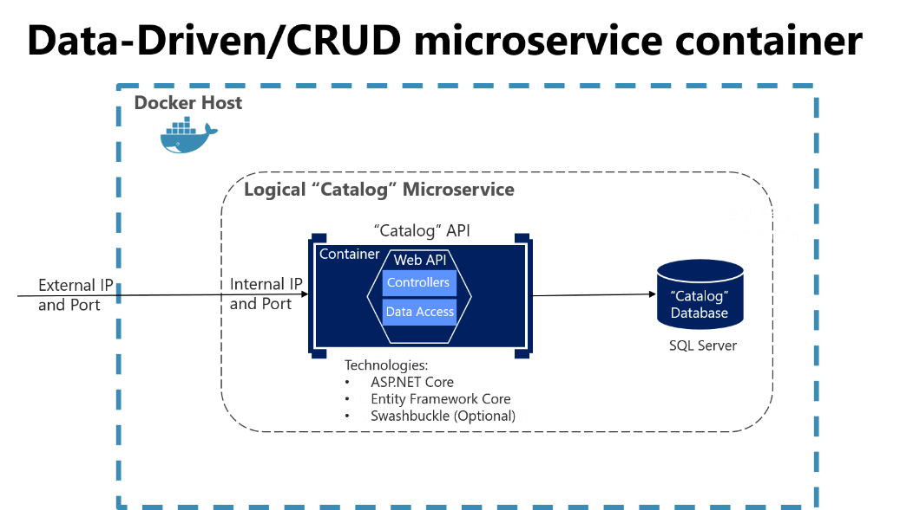

# Catalog

### [Challenge #3: How to achieve consistency across multiple microservices](https://learn.microsoft.com/en-us/dotnet/architecture/microservices/architect-microservice-container-applications/distributed-data-management#challenge-3-how-to-achieve-consistency-across-multiple-microservices)

> The Catalog microservice maintains information about all the products, including the product price.

> When a product's price is updated in the catalog, that price should also be updated in the active baskets that hold that same product, plus the system should probably warn the user saying that a particular item's price has changed since they added it to their basket.

> The Catalog microservice shouldn't update the Basket table directly, because the Basket table is owned by the Basket microservice. To make an update to the Basket microservice, the Catalog microservice [uses] eventual consistency based on asynchronous communication such as integration events (message and event-based communication).

### [Designing a simple CRUD microservice](https://learn.microsoft.com/en-us/dotnet/architecture/microservices/multi-container-microservice-net-applications/data-driven-crud-microservice#designing-a-simple-crud-microservice)

- Page 118 on the e-book.

## Notes

I'll just be copying the code from the tutorial and refactoring it after I get it working. 

Refactoring ideas:

- [ ] Split this up into different projects rather than keeping everything inside `Catalog.Api`.
- [ ] Rename `Catalog.Api` -> `Catalog.Web.Api`.
- [x] Remove usage of [`CatalogDomainException`](https://github.com/dotnet-architecture/eShopOnContainers/blob/8438a6a652ce7db4e271e7cd47071fc4d58fdb8c/src/Services/Catalog/Catalog.API/Infrastructure/Exceptions/CatalogDomainException.cs) and use built-in exceptions. Only affects [`CatalogItem`](https://github.com/dotnet-architecture/eShopOnContainers/blob/8438a6a652ce7db4e271e7cd47071fc4d58fdb8c/src/Services/Catalog/Catalog.API/Model/CatalogItem.cs#L59).
- [x] Move configurations closer to their respective models. The [EntityTypeConfigurationAttribute](https://learn.microsoft.com/en-us/dotnet/api/microsoft.entityframeworkcore.entitytypeconfigurationattribute?view=efcore-8.0) made it easy to link models to their configurations.